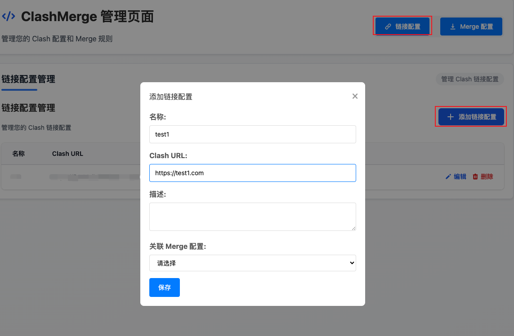
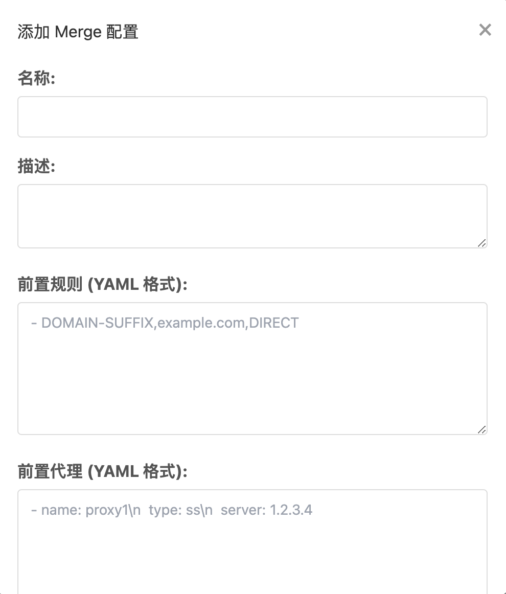

# clashmerge

在原 clash 订阅链接的基础上添加新的规则生成新的订阅链接。

## 部署

```bash
docker run -p host-port:8081 -v /host-path:/data mailth/clashmerge
```

## 配置方式

进入服务管理页面 `<ip:port>/admin`。
页面里的`链接配置`是指原本的 clash 链接。`merge 配置`是希望覆盖到原配置的内容。

### 创建链接配置

首先在“链接配置”里配置原始的订阅链接。
关联配置可以等会创件完 merge 配置后再关联。



这里名称最好用英文，后面会用来生成新的订阅链接，英文的链接简短一些。

### 创建 Merge 配置

创建用于覆盖原链接的配置，目前主要可以配置`规则`，`代理`，`代理组`。
配置好的内容会插入到原始链接配置的最前面。



#### 前置规则配置

只要是符合 clash 的路由规则形式都可以在这里配置，比如

```yaml
- DOMAIN,ad.com,REJECT
- DOMAIN-SUFFIX,google.com,auto
- DOMAIN-KEYWORD,google,auto
- DOMAIN-WILDCARD,*.google.com,auto
- DOMAIN-REGEX,^abc.*com,PROXY
- GEOSITE,youtube,PROXY

- IP-CIDR,127.0.0.0/8,DIRECT,no-resolve
- IP-CIDR6,2620:0:2d0:200::7/32,auto
- IP-SUFFIX,8.8.8.8/24,PROXY
- IP-ASN,13335,DIRECT
- GEOIP,CN,DIRECT
```

#### 前置代理配置

配置新的代理，比如

```yaml
- name: "ss1"
  type: ss
  server: server
  port: 443
  cipher: chacha20-ietf-poly1305
  password: "password"
- name: "ss2"
  type: ss
  server: server
  port: 443
  cipher: chacha20-ietf-poly1305
  password: "password"
```

#### 前置代理组配置

添加新的代理组

```yaml
- name: Proxy
  type: select
  proxies:
    - ss
    - vmess
    - auto
```

### 关联配置

在`链接配置`里关联`Merge 配置`就可以了。

## 访问

在 clash 软件里配置 `<域名>?name=<链接配置名称>` 即可。
